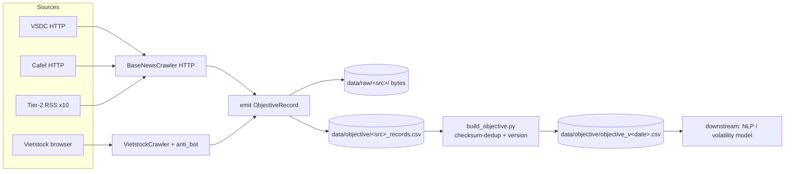

# Architecture Spine — Objective Vietnam Stock Data Crawler

## Design Paradigm

**Adapter → Canonical-Record → Layered-Stores.** Mỗi nguồn = 1 adapter (port) chuẩn hóa nội dung thành một **ObjectiveRecord** duy nhất; record chảy qua 3 lớp store tách biệt: **raw** (bytes gốc, reproduce) → **cleaned** (per-source CSV) → **unified** (dataset versioned, deduped, objective-only). Adapters HTTP subclass `BaseNewsCrawler` (Template Method đã có); adapter browser reuse `VietstockCrawler`/`utils/anti_bot`. Cả hai họ hội tụ về cùng ObjectiveRecord — đó là hợp đồng giữ mọi unit nhất quán.



## Invariants & Rules

### AD-1 — Canonical ObjectiveRecord (unified output contract)
- **Binds:** all objective adapters (FR-8,16,17,4,15) — `all`
- **Prevents:** mỗi adapter tự đặt cột → dataset không merge/join được
- **Rule:** mọi adapter emit record với ĐÚNG field set: `document_id, source, source_tier, url, publish_time, crawl_time, company_code, company_name, title, raw_text, language, category, event_type, attachment_urls, checksum, raw_path`. Không thêm/bớt cột. Field set định nghĩa **đúng một chỗ**: `objective/schema.py::ObjectiveRecord` (single source of truth, mọi adapter import, không định nghĩa lại). (Schema news `CSV_HEADERS` giữ cho opinion crawlers — layer objective dùng ObjectiveRecord riêng.)

### AD-2 — Layered storage: raw bytes tách khỏi cleaned records
- **Binds:** FR-9, tất cả adapter
- **Prevents:** trộn raw HTML/PDF với record đã parse → mất khả năng reproduce/re-parse
- **Rule:** raw bytes → `data/raw/<source>/<document_id>.{html,pdf}`; cleaned ObjectiveRecord → `data/objective/<source>_records.csv`. Cleaned phải derivable từ raw. `raw_path` field trỏ tới file raw.

### AD-3 — Timestamps là tz-aware UTC (ISO-8601)
- **Binds:** publish_time, crawl_time — tất cả record
- **Prevents:** ambiguity +07 (HN_TZ) vs UTC → model join sai múi giờ
- **Rule:** `publish_time`/`crawl_time` dạng **canonical UTC duy nhất** `YYYY-MM-DDTHH:MM:SSZ` (không offset khác). Quy tắc convert: (a) nguồn có offset → convert sang UTC; (b) nguồn **không offset** (ngầm VN) → giả định `+07` rồi convert; (c) nguồn **date-only** (`15/03/2026`) → `YYYY-MM-DDT00:00:00Z`. `build_objective.py` reject (regex) mọi row không khớp canonical — không silently pass ngày lệch (tránh training-label sai). **[DIVERGENCE]** `base_news_crawler.py` dùng `HN_TZ`(+07) cho `collected_at` → adapter objective ghi UTC, không kế thừa `now_iso()` nguyên vẹn; opinion crawlers giữ nguyên (out of scope).

### AD-4 — company_code = uppercase HOSE ticker, validate theo VN30 list
- **Binds:** FR-8, universe filter — record Tier-1
- **Prevents:** casing/alias ticker drift (VNM vs vnm vs "Vinamilk") → join fail
- **Rule:** `company_code` = uppercase, regex `^[A-Z0-9]{3,5}$`, nguồn từ VN30 list (AD-5). Tier-1 (disclosure/VSDC) bắt buộc có; Tier-2 news `company_code` **nullable** tới khi NLP (raw capture chỉ).

### AD-5 — Single VN30 universe source-of-truth
- **Binds:** tất cả adapter (filter), AD-4
- **Prevents:** mỗi adapter hardcode list ticker khác nhau → filter không nhất quán
- **Rule:** `config/vn30.yaml` giữ list chính thức VN30 (`ticker, company_name, exchange=HOSE`), rebalance 6 tháng/lần. Mọi adapter đọc file này. Một file, một owner.

### AD-6 — Dedup: (source, canonical_url) AND content-checksum
- **Binds:** FR-10, resume
- **Prevents:** re-crawl cùng doc (url) AND near-dupes cross-source (Vietstock vs Cafef repub cùng sự kiện)
- **Rule:** url-dedup trong source (resume, kế thừa `BaseNewsCrawler._load_seen`); **checksum** = `sha256(checksum_normalize(raw_text))` dedup cross-source ở build step; `checksum` field lưu trên mọi record. `checksum_normalize` định nghĩa **đúng một chỗ** `objective/schema.py`: `NFC` unicode → lowercase → strip HTML tags → collapse whitespace → **không truncate**. Có conformance fixture cross-source (cùng disclosure qua VSDC/Vietstock/Cafef phải ra cùng checksum). *(Không dùng `body_extractor.normalize_body` — đó là display normalizer, khác ngữ nghĩa.)*

### AD-7 — Hai họ adapter, cùng emit ObjectiveRecord
- **Binds:** FR-16 (browser), FR-4/15/17 (HTTP)
- **Prevents:** adapter browser vs HTTP phân kỳ output contract
- **Rule:** (a) HTTP objective sources subclass `BaseObjectiveCrawler(BaseNewsCrawler)` — **NEW** (`objective/base_objective_crawler.py`): override `_init_csv`/`_append`/`_load_seen` (dùng ObjectiveRecord headers, **không** kế thừa `CSV_HEADERS` 12-cột của base) + `_fetch_and_parse` (emit ObjectiveRecord, UTC theo AD-3, checksum theo AD-6); giữ hooks `listing_url/parse_listing/parse_article/next_page` đã ratify. (b) Browser source (Vietstock per-company disclosure) reuse `VietstockCrawler` + `utils/anti_bot` (`safe_goto`, stealth), wrap emit ObjectiveRecord cùng schema. Cả hai → AD-1.

### AD-8 — Per-source isolation + build-merge → dataset versioned
- **Binds:** FR-12, FR-13
- **Prevents:** crawler khổng lồ coupled; mất reproduce model
- **Rule:** mỗi adapter ghi `data/objective/<source>_records.csv` riêng (resumable, isolated). `objective/build_objective.py` (sibling `merge_news.py`) merge per-source → `data/objective/objective_v<YYYYMMDD>.csv` (checksum-deduped). Mỗi release = version snapshot (reproduce).

### AD-9 — Objective/opinion separation tại ranh giới dataset
- **Binds:** FR-13, model integrity
- **Prevents:** opinion data (Vietstock analysis, broker research SSI/HSC/VNDIRECT, cafef opinion) nhiễm training set objective
- **Rule:** `data/objective/` KHÔNG bao giờ merge từ CSV opinion (`vnstock_articles.csv`, `ssi/hsc/vndirect`, `cafef_articles`). Tree tách biệt. `build_objective.py` chỉ đọc objective source CSV.

### AD-10 — Scheduler extension kế thừa pattern hiện có
- **Binds:** FR-14 — `[ADOPTED]`
- **Prevents:** crawler mới chạy ad-hoc → data stale
- **Rule:** extend `run_daily_all.ps1` invoke objective crawler (VSDC latest + Vietstock VN30 disclosure + Tier-2 RSS) trước 06:00. Kế thừa Task Scheduler `CrawlDailyNews` @ 05:00.

### AD-11 — event_type enum chuẩn (taxonomy contract)
- **Binds:** FR-8, tất cả adapter gán event_type
- **Prevents:** taxonomy drift (adapter A "dividend" vs B "cash_dividend")
- **Rule:** `event_type ∈ {financial_statement, board_resolution, dividend, stock_issuance, stock_split, rights_issue, esop, insider_trading, shareholder_change, ma, exec_change, agm, bond_issuance, foreign_ownership, extraordinary_announcement, other}`. Enum định nghĩa 1 chỗ (`objective/schema.py`), mở rộng được (VN30 là equity nhưng VSDC có bond/foreign-ownership). `category` (riêng biệt) = free-text source section, **không** governed (low-stakes) — đừng nhầm với `event_type`.

### AD-12 — company_name bound to VN30-canonical; ticker never in name
- **Binds:** company_code, company_name — tất cả record Tier-1
- **Prevents:** adapter A đặt ticker trong `company_code` + name chuẩn, adapter B name rỗng, adapter Tier-2 park ticker trong `company_name` (code null) → filter `company_code='VNM'` drop nhầm
- **Rule:** khi `company_code` non-null → `company_name` = VN30-canonical name (từ `config/vn30.yaml`, không tên adapter tự parse). Ticker **không bao giờ** trong `company_name`. `company_code` null ⇒ `company_name` null (xếp đôi).

### AD-13 — canonicalize_url + identity: document_id per-source, checksum cross-source
- **Binds:** document_id, url, dedup cross-source (AD-6)
- **Prevents:** cùng doc qua nhiều source ra id khác nhau (OK raw) NHƯNG join cross-source bằng document_id double-count; cùng source `?a=1&b=2` vs `?b=2&a=1` → resume dedup miss → re-crawl
- **Rule:** `document_id = sha1(source + canonicalize_url(url))[:16]` là identity **per-source only** (không join cross-source bằng nó). `canonicalize_url` (shared, `objective/schema.py`) chuẩn hóa query-param order + strip tracking. Cross-source identity **duy nhất** = `checksum` (AD-6) — `build_objective` dedup cross-source bằng checksum, không bao giờ document_id.

### AD-14 — Tier-2 unenriched → companion file; enrichment = build riêng
- **Binds:** FR-15 Tier-2 news, AD-4 (company_code nullable), AD-8 (merge)
- **Prevents:** null `company_code` Tier-2 → build hoặc drop (mất data AD-4 capture) hoặc keep (vỡ filter VN30 AD-5) — cả hai "spine-compliant" nhưng sai; enrichment NLP mutate row unified → 2 owner entity-time
- **Rule:** Tier-2 news chưa enrich → `data/objective/news_unenriched_<source>_records.csv` (**companion**, không vào unified VN30 dataset). Enrichment (NLP → company_code) là **build step riêng**, sinh record enriched mới, **không mutate** row unified. Unified `objective_v<date>.csv` chỉ chứa record có `company_code` ∈ VN30.

## Consistency Conventions

| Concern | Convention |
| --- | --- |
| Naming | adapter file `objective/adapters/<source>_crawler.py`; CSV `data/objective/<source>_records.csv`; raw `data/raw/<source>/<document_id>.<ext>` |
| IDs | `document_id` = `sha1(source + canonicalize_url(url))`[:16] — **per-source identity only** (AD-13); khác `short_id` md5 của news layer (tránh đụng id-space) |
| Identity/dedup | cross-source = `checksum` ONLY (AD-6, AD-13); `checksum_normalize` + `canonicalize_url` defined in `objective/schema.py` |
| Dates | ISO-8601 UTC canonical `YYYY-MM-DDTHH:MM:SSZ` (AD-3) |
| category vs event_type | `event_type` = governed enum (AD-11); `category` = free-text source section, ungoverned |
| Encoding | CSV `utf-8-sig` (BOM) — kế thừa; PYTHONUTF8=1 Windows |
| Dedup | url trong source (resume) + checksum cross-source (AD-6) |
| UA/fetch | stable UA `UA_HEADERS` kế thừa; browser dùng `utils/anti_bot` stealth; **không** fake-useragent mỗi request (pitfall đã fix) |
| Config | `.env` + sibling config file (`<source>_config.py`) kế thừa; bật/tắt nặng qua flag (`DOWNLOAD_PDF`, `--no-playwright`) |
| Error/logging | audit log `logs/<source>_audit.log` kế thừa; fail → log, continue (không crash) |

## Stack (seed — verified existing, ratified)

| Name | Version |
| --- | --- |
| Python | 3.13 (`.python-version`, uv env) |
| requests | HTTP adapters (VSDC, Cafef, Tier-2 RSS) |
| playwright + chromium + playwright-stealth | browser adapter (Vietstock disclosure) |
| lxml, PyMuPDF | parse HTML/PDF raw |
| pandas | build/merge/dedup |
| Windows Task Scheduler | daily schedule (run_daily_all.ps1) |

## Structural Seed

```text
crawl_data/
  base_news_crawler.py            # ratified HTTP framework (AD-7a)
  crawler.py                      # VietstockCrawler (reuse FR-16, AD-7b)
  utils/anti_bot.py body_extractor.py dedup.py   # reuse
  config/vn30.yaml                # AD-5 universe (NEW)
  objective/                      # NEW — objective layer
    schema.py                     # ObjectiveRecord + event_type enum + checksum_normalize + canonicalize_url (AD-1,6,11,13)
    base_objective_crawler.py     # NEW: BaseObjectiveCrawler(BaseNewsCrawler) — override CSV/dedup/fetch for ObjectiveRecord (AD-7)
    adapters/
      vsdc_crawler.py             # FR-4,5 (HTTP, ID sweep)
      vietstock_disclosure.py     # FR-16 (browser, per-company VN30)
      cafef_disclosure.py         # FR-17 (HTTP)
      tier2_rss/                  # FR-15 (10 subclass nhỏ)
    build_objective.py            # AD-8 merge + checksum-dedup cross-source + UTC-validate + version
    redact.py                     # OQ-5 (future: SSC/insider PDPD)
  config/vn30.yaml                # AD-5 universe (ticker + canonical company_name — feeds AD-12)
  data/
    raw/<source>/<doc_id>.{html,pdf}            # AD-2
    objective/<source>_records.csv              # AD-2 cleaned per-source
    objective/news_unenriched_<source>_records.csv  # AD-14 Tier-2 raw (null company_code)
    objective/objective_v<date>.csv             # AD-8 unified VN30 versioned
  run_daily_all.ps1               # AD-10 (extend)
```

## Capability → Architecture Map

| Capability / FR | Lives in | Governed by |
| --- | --- | --- |
| FR-4,5 VSDC corporate actions | `objective/adapters/vsdc_crawler.py` | AD-1,2,3,4,6,7 |
| FR-16 Vietstock VN30 disclosure | `objective/adapters/vietstock_disclosure.py` | AD-7, AD-5 |
| FR-17 Cafef VN30 disclosure | `objective/adapters/cafef_disclosure.py` | AD-7 |
| FR-15 Tier-2 news (10 báo) | `objective/adapters/tier2_rss/` | AD-7 (company_code nullable) |
| FR-8 canonical schema | `objective/schema.py` | AD-1, AD-11 |
| FR-9 raw preservation | `data/raw/<source>/` | AD-2 |
| FR-10 dedup | base (url) + `build_objective.py` (checksum) | AD-6 |
| FR-11 resumable | `BaseNewsCrawler._load_seen` (url) | ratified |
| FR-12 dataset versioning | `build_objective.py` → `objective_v<date>.csv` | AD-8 |
| FR-13 objective/opinion separation | `data/objective/` (no opinion merge) | AD-9 |
| FR-14 daily schedule | `run_daily_all.ps1` | AD-10 |

## Deferred

- **NLP/feature layer** (event extraction, sentiment, NER, embedding) + volatility model — downstream PRD/spine riêng; spine này chỉ raw+metadata.
- **Macro gap** (CPI/PMI/credit/FDI monthly, OQ-3) — thuộc macro crawler riêng (đã có Tier-1 reuse); không thuộc spine objective này.
- **SSC regulatory** (FR-7, Oracle ADF/Playwright) + **HOSE-direct** (dropped) — epic sau; nếu build SSC, phải kèm `objective/redact.py` strip personal names (PDPD Decree 13/2023, OQ-5).
- **Tier-2 enrichment** (company_code/event_type từ news text) — cần NLP; raw capture trước, enrich sau.
- **HNX/UPCoM** (FR-1,2,3) — out of VN30 scope; re-enable nếu universe mở rộng.
- **Operational envelope** (deployment/environments/infra) — **[ADOPTED]** kế thừa project hiện có: single Windows box, `.env` config, file+CSV store (không DB/cloud), Task Scheduler, audit log. Không re-invent.
- **Raw retention policy** (open Q cho stories) — `data/raw/<source>/` lớn dần vô hạn; cần quy tắc retention/prune (theo version dataset đã snapshot). Chưa fix ở altitude này.
- **Stack version hygiene** — Python 3.13 **EOL 2026-10** (3.14 đã ship): objective layer là greenfield → note migration path. `pyproject` pin `playwright-stealth>=1.0.0` stale (code dùng v2 API) + `pandas>=2.0.0` span 3.0 break → tighten `>=3.0` khi build `build_objective.py` (story-level, không propagate pin lỗi vào spine).
- **HOSE OAuth / proxy xoay vòng / Gmail alert** — existing open follow-ups (theo crawler-project-status), không thuộc spine này.
