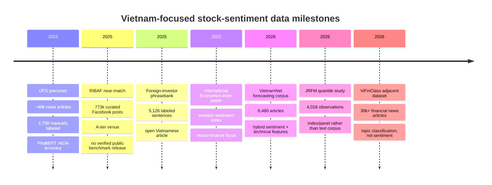

# Vietnamese Stock-Market Sentiment Datasets and Benchmarks

## Executive summary

After screening 2025–2026 literature against a strict **A/A\*** criterion, I did **not** find a paper that simultaneously satisfies all of the user’s requirements: **peer-reviewed**, **published in an A/A\* venue**, **focused exclusively on Vietnam**, and **explicitly presenting/benchmarking/releasing a reusable dataset for Vietnamese stock-market sentiment analysis**. I used the **2025 ABDC Journal Quality List** for journal-tier screening and **CORE/ICORE 2026** for conference-tier screening. Targeted searches across ACL/EMNLP-style venues, ACM DL, IEEE Xplore, SpringerLink, and ScienceDirect did not surface a qualifying 2025–2026 A/A\* conference paper; the only clear **A-tier** journal near-match I found is a 2025 **Research in International Business and Finance** article that uses a large Facebook-derived Vietnam sentiment corpus but does **not** present it as an open benchmark dataset. citeturn11view2turn42search19turn42search0turn42search8turn9search0turn43search1turn43search0turn17search0turn39search0

The strongest **Vietnam-only dataset paper** I found in 2025–2026 is instead a **local open-access Vietnamese journal article**: *Xây dựng ngân hàng câu cảm xúc tài chính về hành vi đầu tư của khối ngoại* (2025), which builds a labeled **5,126-sentence** Vietnamese financial sentiment phrasebank from official-market news about foreign investors’ trading behavior, benchmarked with Logistic Regression, Random Forest, and SVM; SVM is reported as best at **89% accuracy**. A second useful but still non-top-tier 2026 open-access paper uses **6,480 VietnamNet articles** plus VN-Index data to build a sentiment-driven forecasting dataset and compares Naive Bayes, Logistic Regression, SVM, Random Forest, Gradient Boosting, AdaBoost, and CatBoost, reporting that ensemble models perform best but without a fully reusable public benchmark package. citeturn51view2turn50view0turn7view3turn8view0turn45view0turn47view0turn48view0turn48view1

The closest **A-tier** paper is Nguyen et al. (2025) in **Research in International Business and Finance**. It uses a decade-long **Facebook** corpus for Vietnam, with roughly **773,000 curated posts from an initial 900,000**, and applies VECM, logistic regression, quantile regression, and a set of ML models including DTR, SVM, NN, GBM, RF, and DNN. However, accessible official metadata do **not** show a released dataset, code repository, annotation protocol, license, or benchmark split. That means it is highly relevant substantively, but weak as a reusable benchmark artifact. citeturn17search0turn17search1turn17search5turn18view0turn39search0

The practical implication is clear: for **Vietnamese stock sentiment**, the literature in 2025–2026 is advancing faster on **behavioral-finance applications** than on **benchmark-quality, open, reproducible data infrastructure**. The best path forward is to treat the 2025 phrasebank paper, the 2026 VietnamNet forecasting corpus, the 2023 open MDPI precursor, and the available online repositories/APIs as **building blocks** for a new VN-specific benchmark rather than as a finished benchmark ecosystem. citeturn51view2turn45view0turn52view0turn33view1turn33view2turn32view2

## Search strategy and inclusion rules

I interpreted **“A, A\* journals and conferences”** using recognized ranking systems that actually label venues in that style: **ABDC 2025** for journals and **CORE/ICORE 2026** for conferences. ABDC states that its 2025 list is the output of a formal review process across more than 2,600 journal titles, while CORE/ICORE publishes A/A\*/B-style conference rankings. This gave a clean and auditable filter for “top-tier” in the user’s sense. citeturn11view2turn42search19

The web search itself was intentionally broad and source-first. I searched **official venue/host domains** and primary publisher pages, including ACL Anthology, ACM DL, IEEE Xplore, SpringerLink, ScienceDirect, MDPI, World Scientific, and Vietnamese journal portals, then followed DOI and institutional repository pages for metadata, abstracts, PDFs, and licensing details. Venue-targeted searches on ACL/EMNLP-style domains returned unrelated Vietnamese NLP papers or workshop proceedings rather than Vietnam-only stock-sentiment datasets, while ACM DL surfaced a relevant **2024** ACM paper but not a matching **2025–2026** dataset benchmark. citeturn9search0turn9search1turn9search4turn43search1turn43search3

I applied a **strict inclusion rule** for the primary list: the paper had to be **peer-reviewed**, **2025 or 2026**, **Vietnam-only**, and either **present**, **benchmark**, or **organize** a dataset or sentiment resource for the stock market. When that strict filter produced no full A/A\* match, I retained the **closest peer-reviewed near-matches** in ranked order and then added a separate section of **authoritative non-peer-reviewed sources** such as official exchange disclosures, broker APIs, finance portals, GitHub repositories, and Kaggle assets. citeturn17search0turn45view0turn15search1turn23search4turn24search2turn32view0turn31search2

## Peer-reviewed papers

The short version is that the **strict A/A\*** list is empty, but there are several important **near-matches** and **non-top-tier Vietnam-only dataset papers** worth using.

**Closest A-tier paper and best top-tier near-match: Nguyen, Ngo, Pham, and Nguyen (2025), *Investor sentiment and market returns: A multi-horizon analysis*.**  
**Full citation:** Huan Huu Nguyen, Vu Minh Ngo, Luan Minh Pham, and Phuc Van Nguyen. 2025. *Investor sentiment and market returns: A multi-horizon analysis*. **Research in International Business and Finance**, Vol. 74, Article 102701. **DOI:** 10.1016/j.ribaf.2024.102701. **Venue tier:** **ABDC A**. **Dataset name:** unspecified in accessible metadata. **Dataset description:** a decade-long **Facebook** dataset for the Vietnamese stock market, with about **773,000 curated posts from an initial 900,000**, covering **2013–2023**. **Language:** unspecified in accessible official metadata, though the Vietnam-only context strongly suggests Vietnamese-language social content. **Labels:** sentiment is used to construct indices; accessible metadata do **not** describe a released per-post labeled corpus. **Preprocessing:** accessible metadata only state that the corpus was curated from 900,000 down to 773,000 posts; further cleaning and annotation details are unspecified. **Benchmark tasks and metrics:** long-run relation modeling via **VECM**, short-run analysis via **logistic regression** and **quantile regression**, and prediction of abnormal returns with **DTR, SVM, NN, GBM, RF, and DNN**. **Results:** official metadata report that sentiment indicators show strong predictive power and are more influential at lower return quantiles; the paper also states sentiment is more predictive than traditional autoregressive baselines. **License/access:** article metadata are public on ScienceDirect and UEH’s repository, but the full article is paywalled; dataset license and download instructions are unspecified. **Reproducibility artifacts:** no public code or data link was identified in the official metadata I could verify. citeturn17search0turn17search1turn17search5turn18view0turn39search0

**Best open Vietnam-only dataset paper, but not in an A/A\* venue: Xuân, Như, and Phúc (2025), *Xây dựng ngân hàng câu cảm xúc tài chính về hành vi đầu tư của khối ngoại*.**  
**Full citation:** Phạm Thị Thanh Xuân, Đặng Anh Như, and Từ Hà Phúc. 2025. *Xây dựng ngân hàng câu cảm xúc tài chính về hành vi đầu tư của khối ngoại* (Building a financial sentiment phrasebank on foreign investors’ trading behavior). **Tạp chí Phát triển Khoa học và Công nghệ – Kinh tế-Luật và Quản lý**, 9(1): 6103–6112. **DOI:** 10.32508/stdjelm.v9i1.1548. **Venue tier:** peer-reviewed local Vietnamese open-access journal; no A/A\* evidence was found for this venue in the ranking sources I used. **Dataset name:** *Ngân hàng câu cảm xúc tài chính về hành vi của khối ngoại* (financial sentiment phrasebank on foreign-investor behavior). **Dataset description:** the paper says it selected **4,065** articles from **36,461** official-market news items published in **2024**, specifically from **VnExpress** and **VnEconomy**; it then extracted **7,130** message sentences using regex and produced a final labeled phrasebank of **5,126** Vietnamese sentences. **Language:** Vietnamese. **Labels:** **binary positive/negative** sentiment. **Size and preprocessing:** article-level news were reduced to sentence-level “message” units; annotation was done manually by finance experts with more than 20 years of Vietnam market experience; semantic encoding used **OpenAI text-embedding-3-large**. **Benchmark tasks and metrics:** supervised sentiment classification with **Logistic Regression**, **Random Forest**, and **SVM**; evaluation includes **Precision, Recall, F1-score, Accuracy, and Confusion Matrix**. **Baseline models and results:** Logistic Regression and Random Forest both achieve about **87% accuracy**; **SVM reaches 89% accuracy**, with reported recognition rates of **94.71%** for negative sentiment and **84.27%** for positive sentiment. **License/access:** the article is open access and the first-page PDF shows **CC BY 4.0**; the paper says code-source details are attached, but a stable public repository or standalone data download was not identified in the accessible metadata. **Reproducibility artifacts:** article PDF open; code/data link unspecified. This is the strongest dataset-centric Vietnam-only paper I found for 2025–2026. citeturn8view0turn51view2turn50view0turn50view1turn7view3turn8view1

**Best open forecasting-corpus paper for 2026, still outside A/A\*: Nguyen, Huy, and Phu (2026), *Sentiment-driven forecasting of the stock index in Vietnam: A machine learning perspective*.**  
**Full citation:** Nguyen Anh Phong, Tam Phan Huy, and Thanh Ngo Phu. 2026. *Sentiment-driven forecasting of the stock index in Vietnam: A machine learning perspective*. **VNUHCM Journal of Economics, Business and Law**, 10(1): 6410–6424. **DOI:** 10.32508/stdjelm.v10i1.1687. **Venue tier:** peer-reviewed local Vietnamese open-access journal; not an A/A\* hit in the ranking sources I used. **Dataset name:** unspecified. **Dataset description:** **6,480 VietnamNet news articles** from **2019–2025** combined with daily **VN-Index** historical data. The text pipeline extracts **polarity, subjectivity, compound scores, and sentiment proportions** at **title, excerpt, and content** levels, then combines them with technical indicators such as **MA, RSI, MACD, Bollinger Bands, and volatility**. The descriptive table in the PDF shows **1,196 daily observations** at the modeling stage after aggregation. **Language:** Vietnamese, because the source corpus is VietnamNet financial news. **Labels/tasks:** binary movement prediction, **“Up” vs. “Unchanged/Down.”** **Benchmark tasks and metrics:** **10-fold cross-validation** with **accuracy, precision, recall, F1-score, and ROC-AUC**. **Baseline models and results:** **Naive Bayes, Logistic Regression, SVM, Random Forest, Gradient Boosting, AdaBoost, and CatBoost**; the paper reports that **CatBoost, Gradient Boosting, and Random Forest** consistently outperform the linear/probabilistic baselines on accuracy, recall, and F1, while Logistic Regression and AdaBoost are competitive on ROC-AUC. Exact best scores are not given in the accessible abstract text I could verify. **License/access:** the article is explicitly **CC BY 4.0** and downloadable. **Reproducibility artifacts:** no public data repository or code repository is specified in the accessible article metadata. citeturn45view0turn47view0turn48view0turn48view1turn49view0

**Behavioral-finance near-match with a B-tier venue rather than A/A\*: Khanh (2026), *Investor Sentiment and Market Volatility Across Quantiles: Evidence from Vietnam*.**  
**Full citation:** Pham Dan Khanh. 2026. *Investor Sentiment and Market Volatility Across Quantiles: Evidence from Vietnam*. **Journal of Risk and Financial Management**, 19(5): 349. **DOI:** 10.3390/jrfm19050349. **Venue tier:** **ABDC B**, not A/A\*. **Dataset name:** unspecified. **Dataset description:** a Vietnam-only empirical dataset with **4,018 observations** spanning **2015–2025**, where sentiment indices are constructed from **market-based** and **survey-based** indicators. **Language:** not applicable in the same way as a text corpus; this is an index/panel dataset rather than a released text benchmark. **Tasks and methods:** **quantile causality** and **QVAR** to model nonlinear links among investor sentiment, stock returns, and volatility. **Results:** sentiment significantly affects returns, strongest at extreme quantiles; smaller-cap stocks are more sensitive; effects on volatility are proxy- and state-dependent. **License/access:** the article is open access on MDPI. **Reproducibility artifacts:** the accessible metadata do not provide a confirmed public dataset or code package, although an **ORCID record** for the author lists a **Zenodo** item associated with this title; the exact contents of that Zenodo record are unspecified in the available metadata, so I would not treat it as a verified open-data release without manual inspection. citeturn15search0turn15search1turn15search5turn16search0turn40search0

**Best open benchmark precursor before the requested window: Vu, Pham, Kieu, and Pham (2023), *Sentiments Extracted from News and Stock Market Reactions in Vietnam*.**  
I am including this paper because it is still one of the most concrete, open, and methodologically useful Vietnamese precursors for 2025–2026 benchmark construction. **Full citation:** Loan Thi Vu, Dong Ngoc Pham, Hang Thu Kieu, and Thuy Thi Thanh Pham. 2023. *Sentiments Extracted from News and Stock Market Reactions in Vietnam*. **International Journal of Financial Studies**, 11(3): 101. **DOI:** 10.3390/ijfs11030101. **Dataset description:** nearly **40,000** articles crawled from **CafeF**, **VnEconomy**, and **Stockbiz** over roughly **July 2021 to July 2022**; the authors manually labeled **2,738** news articles into **positive** and **negative** classes. **Benchmark:** PhoBERT-based sentiment classification. **Results:** the paper reports **over 81% accuracy**; in the preprint/PDF tables, **negative F1 = 0.821** and **positive F1 = 0.813**. **Why it matters here:** it is not 2025–2026, but it is the clearest open precursor for building a future 2025–2026 VN stock-sentiment benchmark. citeturn20search0turn52view0turn52view1turn52view2turn52view3

**Two additional adjacent papers matter conceptually, but not as reusable sentiment benchmarks.** First, Ha (2025) in **International Economics** creates a Vietnam investor-sentiment index for 2017–2023 and studies its connectedness with exchange rates; this is useful evidence that the 2025 literature is still emphasizing **index construction** over open text corpora. Second, Nguyen (2026), *ViFinClass: A Benchmark Dataset for Vietnamese Financial News Topic Classification*, introduces a **30,000+**-article CafeF dataset for **topic classification**, not sentiment; it is therefore adjacent rather than directly in scope, but highly promising as a future substrate for VN stock-sentiment labeling. citeturn54search0turn54search2turn21search2turn37search3

## Dataset comparison and timeline

The table below compares the most relevant Vietnam-focused resources I found, including both the closest 2025–2026 papers and the strongest precursor needed to understand the current state of the field.

| Resource | Venue and tier status | Source material and time span | Language | Labels or prediction target | Size | Benchmark models and reported results | Open article / open data / open code | Sources |
|---|---|---|---|---|---|---|---|---|
| **Nguyen et al. 2025, RIBAF** | Peer-reviewed; **ABDC A** | Facebook posts on Vietnam stock market, **2013–2023** | Unspecified in accessible metadata | Sentiment indices; abnormal-return prediction | **773,000 curated posts** from **900,000** | VECM, logistic regression, quantile regression, DTR, SVM, NN, GBM, RF, DNN; official metadata report strong predictive power and improvement over traditional baselines | Article metadata open, full text paywalled; **data unspecified**; **code unspecified** | citeturn17search0turn17search1turn17search5turn18view0turn39search0 |
| **Xuân et al. 2025, foreign-investor phrasebank** | Peer-reviewed local OA journal | VnExpress + VnEconomy official-market news, **2024** | Vietnamese | **Positive / Negative** sentence sentiment | **4,065 articles → 7,130 extracted sentences → 5,126 labeled sentences** | Logistic Regression **87%**, Random Forest **87%**, SVM **89%** accuracy; SVM identifies negative at **94.71%** and positive at **84.27%** | **Open article yes**; **data link unspecified**; code mentioned as attached, but stable public repo not verified | citeturn51view2turn50view0turn7view3turn8view0 |
| **Nguyen et al. 2026, VietnamNet forecasting corpus** | Peer-reviewed local OA journal | VietnamNet news + VN-Index, **2019–2025** | Vietnamese | Daily movement: **Up vs. Unchanged/Down** | **6,480 articles**; modeling stage shows **1,196 daily observations** | Naive Bayes, Logistic Regression, SVM, RF, Gradient Boosting, AdaBoost, CatBoost; ensembles reported best on accuracy/recall/F1 | **Open article yes** under CC BY; **data unspecified**; **code unspecified** | citeturn45view0turn47view0turn48view0turn49view0 |
| **Khanh 2026, JRFM quantile study** | Peer-reviewed; **ABDC B** | Market-based and survey-based sentiment indicators, **2015–2025** | Not a text corpus | Returns/volatility quantile dynamics | **4,018 observations** | Quantile causality and QVAR; strongest effects in extreme quantiles and among small caps | **Open article yes**; **data unspecified**; Zenodo record mentioned in ORCID metadata but contents unverified | citeturn15search0turn15search1turn15search5turn16search0turn40search0 |
| **Vu et al. 2023, IJFS precursor** | Peer-reviewed open-access precursor | CafeF + VnEconomy + Stockbiz, about **Jul 2021–Jul 2022** | Vietnamese | **Positive / Negative** news sentiment | Nearly **40,000** crawled articles; **2,738** manually labeled for training | PhoBERT; **>81% accuracy**, F1 about **0.821** negative and **0.813** positive | **Open article yes**; public benchmark package not clearly published | citeturn20search0turn52view0turn52view1turn52view2turn52view3 |
| **ViFinClass 2026 adjacent resource** | Peer-reviewed adjacent dataset, not sentiment | CafeF, **2006–2023** | Vietnamese | **Topic classification**, not sentiment | **30,000+ articles** | Multiple baselines; PhoBERT reported best in accessible metadata | Open-data status unspecified in accessible metadata | citeturn21search2turn37search3 |

A concise reading of the publication trajectory is that the field moves from an **open 2023 news-sentiment precursor**, to a **2025 A-tier but non-released Facebook corpus**, to a **2025 open phrasebank specialized on foreign-investor behavior**, then to **2026 market-level forecasting and quantile-volatility papers**, with the separate appearance of **ViFinClass** as an adjacent Vietnamese financial-news dataset that is highly relevant for future sentiment work even though it is not itself a sentiment benchmark. citeturn20search0turn17search0turn51view2turn45view0turn15search0turn21search2

## Online sources and repositories

Because the peer-reviewed benchmark layer is thin, the online-source layer matters a great deal. The most useful sources fall into two groups: **official/platform sources** that offer high-quality raw market, disclosure, and news signals; and **community/open-source sources** that are easier to access but require stronger legal, cleaning, and annotation discipline. citeturn24search2turn23search4turn22search6turn22search5turn27search0turn32view2

| Source | Type | What it provides for VN stock sentiment work | Access details | Open data or code status | Sources |
|---|---|---|---|---|---|
| **HOSE** | Official exchange | Listed-company news, disclosures, margin/ineligibility notices, exchange notices, market summaries | Public website; structured disclosure pages; scraping/API terms not stated in accessible snippets | Public web access; re-use terms unspecified in accessible snippets | citeturn24search2turn24search4turn24search6 |
| **HNX** | Official exchange | HNX/UPCoM disclosures, issuer filings, surveillance notices, and technical information services | Public website; HNX also advertises technical information packages/services | Public web access plus commercial information services | citeturn23search4turn23search1turn23search7 |
| **CafeF** | Major Vietnamese finance portal | High-volume market news, sector coverage, data pages, event/news stream; widely used in VN finance NLP work | Public website | Public web pages; licensing/TOS not specified in accessible snippets | citeturn22search6turn22search3turn22search9 |
| **Vietstock / VietstockFinance** | Major Vietnamese finance portal | Market news, finance tools, stock pages, opinion pieces, and broader financial datasets | Public website; finance subplatform available | Public web access; broader professional datafeed services also exist | citeturn22search5turn22search14turn28search15 |
| **VietnamNet securities section** | Mainstream Vietnamese news source | Stock and business-news stream; directly used as corpus source in the 2026 forecasting paper | Public website | Public web access; redistribution rights not open-ended | citeturn36search0turn36search2turn45view0turn36search10 |
| **FireAnt community + API** | Platform + social discussion + official API | Real-time market data, investor community posts, stock pages, and a documented REST API | API docs at FireAnt API; community reading is public, participation/login may be required | Platform is public; API exists; dataset re-use rights depend on platform terms | citeturn27search0turn27search2turn34view0turn27search18 |
| **F319** | Vietnamese investor forum | Long-running stock forum with ticker-centric discussion and high user engagement | Public forum browsing; posting requires account | Publicly readable discussion, but not an official licensed dataset | citeturn35view0turn22search13 |
| **SSI FastConnect API** | Official broker API | Market information and trading connectivity; sample clients in Python/Node/Java | Registration with SSI, API keys, iBoard setup; documentation and sample clients officially provided | Official API access, not open anonymous data | citeturn33view1turn33view3 |
| **VNDIRECT Open API** | Official broker connectivity | Open API connectivity to transaction data systems for institutional/business workflows | Official institutional service; contact/registration required | Official API access, not open benchmark data | citeturn33view2 |
| **Vnstock** | Open-source Python toolkit | Unified access to public Vietnam stock APIs/news endpoints for extraction and analysis workflows | `pip install -U vnstock`; guest/community API-key tiers documented | Code is open; license is **custom and non-commercial** according to project docs | citeturn32view2turn33view4turn44view2 |
| **Kaggle ViFiAr-URL** | Community dataset | Metadata-only Vietnamese financial-article resource with titles and original URLs; useful for weak supervision and URL recovery | Kaggle dataset page | Open Kaggle asset; labels are not sentiment labels | citeturn29search0turn31search2turn31search5 |
| **GitHub: Vietnamese-stock-article-classification** | Community labeled dataset + model | **1,000 CafeF titles** labeled **negative/neutral/positive** with expert help; PhoBERT-based classifier | Public GitHub repository | Open repository; license **unspecified** in accessible metadata | citeturn32view0turn44view0 |
| **GitHub: Daily-news** | Community collection tool | Python app collecting and categorizing Vietnam stock news from ~10 Vietnamese sources; supports ticker extraction and SQLite storage | Public GitHub repository | **MIT License**; not a sentiment benchmark yet | citeturn32view1turn44view1 |
| **GDELT / News APIs** | Global news APIs | Scalable retrieval of Vietnamese news by keyword/language/country, useful for event alignment and external validation | Public documentation; API keys may be needed depending on product | Tooling exists, but this is a retrieval layer rather than a curated VN stock benchmark | citeturn25search0turn25search4turn25search9turn25search13 |

Taken together, these sources are good enough to build a **strong new benchmark**, but not good enough to claim that Vietnam already has a settled, open, top-tier benchmark ecosystem for stock-market sentiment. The main missing pieces are standardized labels, benchmark splits, release governance, and durable public leaderboards. citeturn32view0turn32view1turn33view1turn33view2turn24search2turn23search4

## Gaps and recommended next steps

The clearest gap is **institutional rather than purely technical**: Vietnam-focused stock-sentiment research in 2025–2026 is producing substantive findings, but it is **not yet producing benchmark-grade open resources in A/A\* venues**. The A-tier RIBAF paper uses a very large Facebook corpus without verified public release; the 2025 phrasebank and 2026 VietnamNet work are more dataset-centric and open as articles, but still do not expose a stable, standard public benchmark package with hosted data, official train/dev/test splits, and documented reproduction scripts. citeturn17search0turn18view0turn51view2turn45view0turn47view0

A second gap is **coverage breadth**. Current resources are narrow in one of three ways: they are centered on **foreign-investor behavior only**; they rely on **one news outlet or a small cluster of outlets**; or they operate on **market-level indices instead of reusable text labels**. The 2025 phrasebank is excellent, but highly specialized; the 2026 VietnamNet corpus is broader, but still single-source on the text side; the JRFM paper is useful for behavioral validation but not as a text benchmark; and the 2023 open precursor excludes firm-specific news to focus on market-wide reactions. citeturn51view2turn45view0turn15search1turn52view0turn52view2

A third gap is **annotation richness**. The strongest labeled Vietnamese resources I found remain mostly **binary**—positive vs. negative—or rely on derived sentiment indices rather than richer annotations. What is missing for a modern benchmark is **neutral class coverage**, **event-level labels**, **ticker/entity links**, **source provenance**, **time-aware splits**, and probably **multi-task structure** spanning document sentiment, sentence sentiment, event polarity, and market-reaction prediction. That inference follows directly from the narrow label spaces and evaluation setups used in the current papers. citeturn50view1turn45view0turn15search1turn52view0

The most promising next step is therefore to build a **VNStockSent-Bench** from the source layers already available: official disclosures from **HOSE** and **HNX**, curated market/news streams from **CafeF**, **Vietstock**, and **VietnamNet**, and community sentiment from **FireAnt** and **F319**, with extraction support from **Vnstock**, **SSI**, and **VNDIRECT** where permitted. The benchmark should publish clear document IDs or URLs, source timestamps, train/dev/test periods, ticker mappings, and annotation guidelines; it should also benchmark both **text-only sentiment tasks** and **sentiment-plus-forecasting tasks** so that the resulting dataset can serve both NLP researchers and behavioral-finance researchers. This recommendation is an inference from the present ecosystem: the sources and partial datasets exist, but they are fragmented across official platforms, papers, and community repositories. citeturn24search2turn23search4turn22search6turn22search5turn36search0turn27search18turn35view0turn32view2turn33view1turn33view2

If the goal is specifically to maximize the chance of an **A/A\*** publication in 2027 or later, the benchmark design should look more like a modern shared-task resource than a single empirical paper: multi-source corpus assembly, documented licensing/provenance, public baseline code, rolling time splits to avoid leakage, and at least one strong Vietnamese transformer baseline plus stronger finance-domain baselines. The good news is that the 2023–2026 literature already shows the necessary ingredients: open Vietnamese news sentiment modeling, phrasebank-style sentence labeling, large news corpora, large social corpora, and adjacent Vietnamese financial-news datasets such as **ViFinClass**. What is still missing is the step that turns these ingredients into a **public, benchmarked, reproducible national reference dataset**. citeturn52view0turn51view2turn45view0turn17search0turn21search2turn37search3