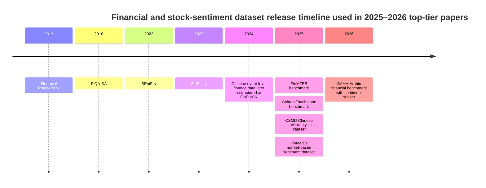
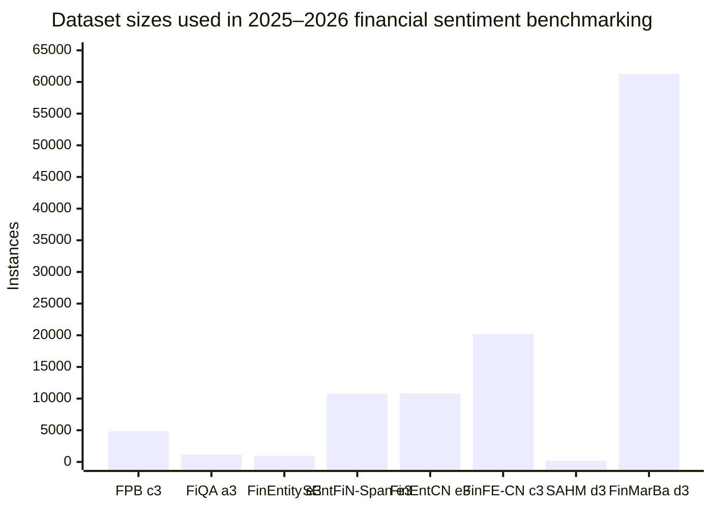

# Benchmark Datasets and Dataset Organization for Stock-Market Sentiment Analysis in Top-Tier Venues

## Executive summary

After screening 2025–2026 primary sources from ACL Anthology, ACM Digital Library, official conference pages, Hugging Face dataset cards, GitHub repositories, and CORE venue-ranking pages, the **high-confidence A/A\*** set for *financial/stock-market sentiment dataset benchmarking or organization* is surprisingly small. The clearest **top-tier A\*** items are **FinMTEB** at **EMNLP 2025** and **SAHM** at **ACL 2026**. A closely related bilingual benchmark, **Golden Touchstone** at **Findings of EMNLP 2025**, is highly relevant because it benchmarks financial sentiment and stock-movement tasks, but **Findings does not have a separately verified A/A\*** ranking in the sources I reviewed, so I mark its venue rank as **unspecified** rather than assuming it inherits EMNLP’s A\*. citeturn33search11turn33search4turn17view0

Two other 2025 papers matter for dataset engineering but are not unambiguous A/A\* inclusions under current ranking evidence. **SILC-EFSA** at **COLING 2025** reconstructs the largest English and Chinese **entity-level** financial sentiment datasets I found in the 2025–2026 literature, but COLING’s rank is **inconsistent across CORE snapshots** in the sources surfaced to me: **A in CORE2018** and **B in CORE2023/ICORE2026**. **CSMD** at **CIKM 2025** is in an **A-ranked** venue, but it is a **stock-analysis** dataset rather than a dedicated sentiment-label benchmark, so I treat it as **adjacent** rather than core. citeturn33search19turn33search22turn33search12turn33search3turn29search1

Across the verified papers, the field is moving in four directions. First, benchmark builders are broadening beyond small English sentence-level sentiment corpora such as **Financial PhraseBank** and **FiQA-SA**, often by bundling them into larger multilingual evaluation suites such as **FinMTEB** and **Golden Touchstone**. Second, there is a clear shift from sentence-level polarity toward **entity-level**, **document-level**, and **market-grounded** labeling. Third, the strongest recent work is increasingly **language- and region-specific**—for example Arabic/MENA in **SAHM** and Chinese in several benchmark suites. Fourth, reproducibility remains uneven because papers differ sharply in **split design**, **metric choice**, **license clarity**, **hidden preprocessing**, and whether they publish the exact evaluation harness. citeturn13view0turn17view0turn20view0turn10view0turn21view4

For benchmarking in 2026, my practical recommendation is to use a **tiered benchmark stack** rather than a single dataset: **Financial PhraseBank** plus **FiQA-SA** for standard English sentence/aspect sentiment, **FinEntity** plus **SEntFiN-Span** for fine-grained entity sentiment, **FinFE-CN** for Chinese sentence-level finance sentiment, and the **SAHM sentiment subset** for Arabic/MENA document-level sentiment. If the goal is market-aligned labeling rather than semantic polarity, **FinMarBa** is the most interesting emerging resource, but it is **not a verified A/A\*** inclusion in the sources I could confirm and only a public subset is currently exposed on Hugging Face. citeturn18view0turn18view4turn10view0turn12search0turn11search1turn21view0turn25view0turn23view0

## Scope and venue-ranking caveats

I prioritized papers that do at least one of three things: **introduce a new financial/stock sentiment dataset**, **reorganize sentiment datasets into a reusable benchmark**, or **benchmark public sentiment datasets in a way that materially affects dataset selection or organization**. I used **primary/official** sources wherever possible: ACL Anthology pages and PDFs, ACM Digital Library entries, official accepted-paper pages, GitHub repositories, Hugging Face dataset cards, and CORE conference-ranking pages. citeturn13view0turn17view0turn20view0turn29search1turn15search0turn19search0turn25view0turn32search0

For venue rank, the cleanest verified cases are **ACL = A\*** and **EMNLP = A\*** in CORE. **CIKM** is **A** in the CORE portal. **Findings of ACL/EMNLP** was **not separately surfaced as an A/A\*** venue in the sources I reviewed, so I mark it **unspecified**. **COLING** is the main ranking ambiguity in this report: the surfaced CORE sources show **A in CORE2018** but **B in CORE2023/ICORE2026**. Because your request explicitly asks for A/A\* venues, I do **not** count COLING 2025 as an unambiguous inclusion; I discuss it as a high-value adjacent paper instead. citeturn33search4turn33search11turn33search3turn33search19turn33search22turn33search12

The result is a **high-confidence core set** of two papers and a **broader directly relevant set** of four additional papers that are important for dataset engineering or benchmark construction but have either venue-ranking ambiguity or weaker sentiment centrality. This is why the inventory below distinguishes **core inclusion** from **adjacent relevance**. citeturn17view0turn20view0turn29search1turn10view0

## Verified paper inventory

The table below separates the **core A/A\*** set from **adjacent but important** papers.

| Paper | Venue and year | Venue rank status | Why it matters for stock/financial sentiment datasets | Core inclusion |
|---|---|---:|---|---:|
| **FinMTEB: Finance Massive Text Embedding Benchmark** | EMNLP 2025 main, URL `https://aclanthology.org/2025.emnlp-main.179/` | **A\*** | Organizes **64 finance datasets** across **7 tasks**; sentiment is one of the benchmarked task families and includes English and Chinese finance-sentiment datasets. | **Yes** |
| **SAHM: A Benchmark for Arabic Financial and Shari’ah-Compliant Reasoning** | ACL 2026 long paper, URL `https://aclanthology.org/2026.acl-long.1593/` | **A\*** | Introduces the **first Arabic financial sentiment benchmark** as part of a broader 7-task finance benchmark; directly relevant for MENA stock/report sentiment. | **Yes** |
| **Golden Touchstone: A Comprehensive Bilingual Benchmark for Evaluating Financial Large Language Models** | Findings of EMNLP 2025, URL `https://aclanthology.org/2025.findings-emnlp.1227/` | **Unspecified** | Organizes **22 datasets across 8 tasks**, including **English/Chinese financial sentiment** and **stock movement prediction**; very useful for dataset organization. | Adjacent |
| **SILC-EFSA: Self-aware In-context Learning Correction for Entity-level Financial Sentiment Analysis** | COLING 2025 main, URL `https://aclanthology.org/2025.coling-main.333/` | **Rank inconsistent in surfaced sources** | Reconstructs large **English and Chinese entity-level financial sentiment datasets** and benchmarks them. | Adjacent |
| **CSMD: Curated Multimodal Dataset for Chinese Stock Analysis** | CIKM 2025, DOI `10.1145/3746252.3761636`, URL `https://dl.acm.org/doi/10.1145/3746252.3761636` | **A** | Important stock-analysis dataset and data-organization paper, but not a dedicated sentiment-labeled benchmark. | Adjacent |
| **FinMarBa: A Market-Informed Dataset for Financial Sentiment Classification** | 2025 preprint / workshop circulation, public paper at `https://arxiv.org/abs/2507.22932` | **Not verified as A/A\*** | Most interesting new **market-reaction-labeled** sentiment dataset; not counted in the top-tier set because venue status is not cleanly verified in primary sources. | Adjacent |
| **MultiFinBen: Benchmarking Large Language Models for Multilingual and Multimodal Financial Application** | ACL 2026 long paper, URL `https://aclanthology.org/2026.acl-long.770/` | **A\*** | Highly relevant broad finance benchmark, but in the sources I reviewed I could not verify enough sentiment-specific dataset detail to include it in the core sentiment table below. | Adjacent |

Evidence for the rows above comes from ACL Anthology pages and PDFs, official accepted-paper listings, ACM Digital Library pages, DBLP, and CORE. citeturn13view0turn20view0turn17view0turn10view0turn29search1turn31search0turn31search5turn32search5turn33search4turn33search11turn33search3turn33search22turn33search19

### Paper-by-paper metadata

#### FinMTEB

**Full citation.** Yixuan Tang and Yi Yang. 2025. *FinMTEB: Finance Massive Text Embedding Benchmark*. Proceedings of the 2025 Conference on Empirical Methods in Natural Language Processing. URL `https://aclanthology.org/2025.emnlp-main.179/`. Code/repo: `https://github.com/yixuantt/FinMTEB`. Venue rank: **EMNLP = A\*** in CORE. citeturn13view0turn15search0turn33search11

**Dataset organization.** FinMTEB is a **benchmark organizer** rather than a single new sentiment corpus. It covers **64 finance-specific datasets**, split into **35 English** and **29 Chinese** datasets across **classification, clustering, retrieval, pair classification, reranking, summarization, and STS**. In the classification family it explicitly includes finance-sentiment datasets such as **FinancialPhraseBank**, **FinSent**, **FiQA_ABSA**, **SemEval2017_Headline**, **FinChina**, and **FinFE**. Languages are **English and Chinese**. The paper frames this as the first comprehensive finance embedding benchmark and releases the benchmark and **Fin-E5** model as open source. citeturn13view0turn14view0

**Relevant sentiment datasets inside the benchmark.** The sentiment-related classification rows surfaced in the paper are: **FinancialPhraseBank**, **FinSent**, **FiQA_ABSA**, **SemEva2017_Headline**, **FinChina**, and **FinFE**. The paper describes the English ones as **polar sentiment datasets** with **positive/negative/neutral** labels; **FinFE** is a Chinese financial social-media sentiment dataset, and **FinChina** is a Chinese finance-domain sentiment dataset. The paper does not, in the lines I reviewed, enumerate full source-side card metadata for each of these datasets; users must consult the original datasets or the benchmark repo. citeturn14view0

**Preprocessing and organization method.** The main innovation is not raw annotation but **standardized task wrapping**: heterogeneous source datasets are re-packaged into a common embedding benchmark with task-specific metrics and a shared evaluation harness based on **MTEB**. That is a strong organizational pattern for future sentiment work because it preserves source tasks while making cross-model comparison reproducible. citeturn13view0turn15search0

**Evaluation protocol and baseline results.** FinMTEB evaluates **15 embedding models** and reports that its finance-adapted **Fin-E5** outperforms generic alternatives overall; one particularly notable result is that **Bag-of-Words unexpectedly beats dense embeddings on financial STS**, which is a warning that finance benchmarks can behave differently from general NLP benchmarks. citeturn13view0

**Accessibility.** The benchmark repo is public on GitHub. The repo description explicitly says it contains **64 financial text datasets across seven tasks** and provides an evaluation script. I did not find a clearly surfaced repo license in the retrieved snippets, so I mark the repo license as **not clearly specified in the reviewed sources**. citeturn15search0

#### SAHM

**Full citation.** Rania Elbadry and colleagues. 2026. *SAHM: A Benchmark for Arabic Financial and Shari’ah-Compliant Reasoning*. ACL 2026 long paper. URL `https://aclanthology.org/2026.acl-long.1593/`. Code and data: `https://github.com/mbzuai-nlp/SAHM` and `https://huggingface.co/SahmBenchmark`. Venue rank: **ACL = A\*** in CORE. citeturn20view0turn21view4turn21view5turn33search4

**Dataset size and sources.** SAHM is a **7-task Arabic financial benchmark** with **14,380 expert-verified instances** sourced from **AAOIFI standards, fatwa archives from seven countries, and Arabic corporate disclosures/reports**. The sentiment component is the **Financial Report Sentiment Analysis** subset: **200 Arabic financial reports** collected from **Argaam**, split into **120 train** and **80 test**, with **100 Islamic-finance-focused** and **100 general** reports. citeturn21view1turn22view0

**Languages and time span.** The benchmark is **Arabic**. The paper emphasizes authentic Arabic financial and Islamic-finance contexts rather than a single explicit publication-date span for every report. For the sentiment subset, the key provenance is **Argaam financial reports**; the reviewed lines do not provide a precise calendar range for those reports, so time span is **not specified in the cited sections**. citeturn22view0

**Labeling method and schema.** The sentiment subset uses **manual expert/native-speaker annotation** with **document-level** labels: **Positive, Negative, Neutral**. Two native Arabic annotators labeled all reports on a custom platform, achieved **κ = 0.91**, then ran a calibration phase; a **third expert adjudicated** remaining disagreements. Mixed-signal reports are labeled by a **dominant-sentiment rule**: assign positive or negative only when one polarity accounts for **more than 60%** of salient content; otherwise label **neutral**. citeturn21view0turn22view0

**Preprocessing.** The benchmark applies deliberate normalization steps across tasks. For sentiment and related evaluation, the paper documents **Unicode/script normalization**, **diacritic removal**, **whitespace and punctuation collapsing**, and **Eastern-Arabic to Western digit mapping** in answer normalization. More broadly, the benchmark removes greetings, honorifics, HTML artifacts, and redundant references while preserving substantive financial and juristic content. citeturn21view0turn22view0

**Evaluation protocol and baseline results.** SAHM evaluates **20 LLMs** across seven tasks. The paper’s key headline result is that Arabic fluency alone does not imply financial reasoning; domain adaptation materially helps. The unified leaderboard mixes MCQ accuracy and open-ended scores. The paper does not isolate the sentiment-subset leaderboard in the lines I reviewed, so I cannot quote a sentiment-specific best baseline without overreaching. citeturn20view0turn21view1

**License and accessibility.** SAHM is unusually clear here: **code and evaluation scripts are MIT**, while **annotation data are CC BY-NC 4.0**; users may need to obtain some source documents independently. Public locations are the **GitHub repo** and **Hugging Face hub** listed above. citeturn21view4turn21view5

#### Golden Touchstone

**Full citation.** Xiaojun Wu and colleagues. 2025. *Golden Touchstone: A Comprehensive Bilingual Benchmark for Evaluating Financial Large Language Models*. Findings of EMNLP 2025. URL `https://aclanthology.org/2025.findings-emnlp.1227/`. Repo: `https://github.com/IDEA-FinAI/Golden-Touchstone`. Venue rank: **unspecified** for Findings in the surfaced ranking sources. citeturn17view0turn19search0

**Dataset organization.** Golden Touchstone is a **bilingual English–Chinese benchmark** with **22 datasets across 8 tasks**. It is highly relevant because it explicitly bundles **financial sentiment analysis**, **classification**, **entity extraction**, **summarization**, **question answering**, **relation extraction**, **multiple choice**, and **stock movement prediction** into one reusable evaluation package. For sentiment specifically, it uses **FPB**, **FiQA-SA**, and **FinFE-CN**. citeturn17view0turn18view0turn18view3

**Sizes, sources, languages, and schemas for the sentiment subsets.** The appendix gives the task-table metadata needed for benchmarking. In English sentiment, **FPB** uses **3,100 train / 776 validation / 970 test**, and **FiQA-SA** uses **750 / 188 / 235**; both are evaluated with **Weighted-F1** and **accuracy**. In Chinese sentiment, **FinFE-CN** uses **16,157 / 2,020 / 2,020**, also with **Weighted-F1** and **accuracy**. FPB and FiQA-SA are English; FinFE-CN is Chinese. All three are effectively **three-way polarity** classification tasks. citeturn18view0

**Evaluation protocol and baseline results.** On the English sentiment tasks in the main results table, **FinMA-7B** reaches **0.9400 Weighted-F1 on FPB** and **0.8370 on FiQA-SA**, while **Touchstone-GPT** reaches **0.8576 on FPB** and **0.8591 on FiQA-SA**. On the Chinese sentiment task **FinFE-CN**, **Touchstone-GPT** reaches **0.7888 Weighted-F1** and **0.7936 accuracy** in the reported table. These results matter because the benchmark exposes how conclusions change across datasets, languages, and models even within “financial sentiment analysis.” citeturn18view0

**Preprocessing and organization method.** The benchmark’s contribution is **task harmonization for LLM evaluation**: it repackages heterogeneous financial datasets with **task-aligned metrics** and **instruction templates** so models can be evaluated consistently across sentiment, stock movement, and related financial tasks. That is exactly the kind of dataset organization the field has lacked. citeturn17view0

**License and accessibility.** The public GitHub repository is under **Apache-2.0**, and the repo states that the benchmark and Touchstone-GPT are open-sourced. The paper itself says the source code and model weights are public. citeturn17view0turn19search0

#### SILC-EFSA

**Full citation.** The retrieved PDF identifies the paper as *SILC-EFSA: Self-aware In-context Learning Correction for Entity-level Financial Sentiment Analysis*. COLING 2025 main paper. URL `https://aclanthology.org/2025.coling-main.333/`. Repo: `https://github.com/NLP-Bin/SILC-EFSA`. Venue rank: **ambiguous for A/A\*** because the surfaced CORE sources disagree across snapshots. citeturn8view0turn11search0turn33search19turn33search22

**Datasets introduced or reorganized.** The paper uses three entity-level sentiment datasets: **FinEntity** (baseline, **979 texts**, **2,131 entities**), **SEntFiN-Span** (reconstructed English dataset, **10,753 texts**, **14,439 entities**), and **FinEntCN** (restructured Chinese dataset, **10,832 texts**, **14,915 entities**). The label schema is **entity-level positive / negative / neutral**, with entity spans explicitly tracked. The paper randomly selects **20% as test data**. citeturn10view0

**Sources, languages, and labeling methods.** **SEntFiN-Span** is reconstructed from **SEntFiN**, a manually annotated English headline dataset with sentiment labels linked to financial entities; SILC-EFSA adds **rule-based entity-location tags** to align it with FinEntity’s format. **FinEntCN** is derived from a Chinese **event-level financial sentiment** dataset of **12,160 news articles and 13,725 five-tuples**; the authors keep single-type entity-label cases and use **rule-based span annotation**, ultimately retaining **10,832** instances. Languages are **English and Chinese**. citeturn10view0

**Preprocessing.** This paper is one of the clearest examples of sentiment-dataset organization by **schema conversion**: sentence/event data are converted into a common **entity-span sentiment** format, making English and Chinese datasets comparable in one task definition. That is a best-practice contribution in its own right. citeturn10view0

**Evaluation protocol and baseline results.** On **FinEntity**, the paper reports **Macro/overall F1** improvements from **0.8681** in Stage 1 to **0.8910** in Stage 2 with GNN retrieval; on **SEntFiN-Span**, Stage 2 reaches **0.7896**; on **FinEntCN**, Stage 2 reaches **0.8675**. These numbers materially raise the bar for entity-level financial sentiment. citeturn9view3

**License and accessibility.** The SILC-EFSA repo is public and marked **Apache-2.0**. The underlying **SEntFiN** repo is public under **MIT**. The **FinEntity** repo is public and states **ODC-BY**. citeturn11search0turn11search1turn12search0

#### CSMD

**Full citation.** Yu Liu, Zhuoying Li, Ruifeng Yang, Fengran Mo, and Cen Chen. 2025. *CSMD: Curated Multimodal Dataset for Chinese Stock Analysis*. CIKM 2025. DOI `10.1145/3746252.3761636`. Code and data framework: `https://github.com/ECNU-CILAB/LightQuant`. Venue rank: **CIKM = A** in the CORE portal. citeturn29search1turn29search4turn29search11turn33search3

**Relevance.** CSMD is not a sentiment-label benchmark in the narrow sense, but it is a strong **data-organization** paper for **Chinese stock-market analysis**, combining **financial news texts and stock prices** within a curated multimodal dataset. Because some current “sentiment-informed” stock work increasingly uses factor extraction instead of explicit polarity labels, CSMD is a useful adjacent resource. citeturn29search0turn29search11

**What is clear from the retrieved sources.** The ArXiv/ACM snippets say the dataset is **publicly available**, is designed specifically for the **Chinese stock market**, and is coupled with the **LightQuant** framework. The retrieved snippets do **not** expose the exact instance counts or sentiment-label schema, so I do not pretend to provide them here. citeturn29search0turn29search11

#### FinMarBa

**Full citation.** Baptiste Lefort, Eric Benhamou, Beatrice Guez, Jean-Jacques Ohana, Ethan Setrouk, and Alban Etienne. 2025. *FinMarBa: A Market-Informed Dataset for Financial Sentiment Classification*. Public paper at `https://arxiv.org/abs/2507.22932`; SSRN DOI `10.2139/ssrn.5365059`. Public dataset card: `https://huggingface.co/datasets/baptle/financial_headlines_market_based`. citeturn5search0turn5search2turn25view0

**Why it matters.** FinMarBa is the clearest 2025 example of a **market-based labeling** strategy rather than manual semantic labeling. The full dataset contains **61,252 annotated headlines** extracted from **Bloomberg Market Wraps** spanning **2010-01-01 to 2024-01-31**; the public Hugging Face subset currently shows **8.14k rows** and **MIT** licensing. Labels are derived automatically using **ticker identification with GPT-4** plus **market reaction quantiles** from rolling five-year price histories, yielding **positive / negative / neutral** labels. citeturn27view0turn25view0

**Evaluation protocol and results.** The paper compares a BERT model trained on FinMarBa with **FinBERT** trained on **Financial PhraseBank**, then backtests sentiment signals on the **S&P 500** from **2019–2024**. FinMarBa achieves a **Sharpe ratio of 0.30**, versus **-0.13** for Financial PhraseBank/FinBERT in the reported comparison. This is a very different evaluation protocol from conventional classification F1 and is arguably more aligned with actual market-use cases. citeturn26view2turn26view0

**Caveat.** I did not verify a clean A/A\* venue assignment for FinMarBa from primary conference proceedings in the reviewed sources, so I treat it as **important but not part of the core A/A\*** set. citeturn28search10turn28search13

## Comparative tables and visualizations

The first table focuses on the **datasets most useful for benchmarking stock/financial sentiment models in 2026**, whether they were introduced, reorganized, or prominently benchmarked in 2025–2026 papers.

| Dataset | First surfaced here as | Size | Data source | Language | Time span | Labeling | Schema | Access / license |
|---|---|---:|---|---|---|---|---|---|
| **Financial PhraseBank** | Legacy baseline reused in FinMTEB and Golden Touchstone | 4,846 total; Golden Touchstone split 3,100 / 776 / 970 | Financial news sentences | English | Not restated in reviewed 2025 sources | Manual human annotation | Sentence-level 3-way polarity | Hugging Face; CC BY-SA 3.0 in Golden Touchstone |
| **FiQA-SA** | Legacy baseline reused in Golden Touchstone | 1,173 total implied by split 750 / 188 / 235 | Financial posts/sentences | English | Not restated in reviewed 2025 sources | Human annotation from source benchmark | Aspect/sentence sentiment, usually mapped to 3-way polarity | MIT License in Golden Touchstone |
| **FinEntity** | Baseline reused in SILC-EFSA | 979 texts; 2,131 entities | Financial news | English | Not restated in SILC-EFSA | Human annotation | Entity spans + 3-way polarity | GitHub; ODC-BY |
| **SEntFiN-Span** | Reorganized in SILC-EFSA | 10,753 texts; 14,439 entities | Financial news headlines from SEntFiN | English | Not specified in SILC-EFSA | Manual source labels + rule-based span reconstruction | Entity-level 3-way polarity | Derived from public SEntFiN repo; MIT on source repo |
| **FinEntCN** | Reorganized in SILC-EFSA | 10,832 texts; 14,915 entities | Chinese financial news | Chinese | Not specified in SILC-EFSA | Source event labels + rule-based span annotation | Entity-level 3-way polarity | Public but reviewed source linked via anonymous repo during paper |
| **FinFE-CN** | Reused in FinMTEB and Golden Touchstone | 20,197 total via split 16,157 / 2,020 / 2,020 | Chinese financial social media / finance text | Chinese | Not restated in reviewed sources | Source-dataset annotation | Sentence-level 3-way polarity | Marked “Public” in Golden Touchstone |
| **SAHM sentiment subset** | Introduced in SAHM | 200 reports; 120 train / 80 test | Argaam financial reports | Arabic | Exact calendar range not specified | Manual annotation by 2 native annotators + expert adjudication | Document-level 3-way polarity | SAHM: data CC BY-NC 4.0; code MIT |
| **FinMarBa** | Introduced in FinMarBa | 61,252 full; 8.14k public subset | Bloomberg Market Wraps + price series | English headlines, global tickers | 2010-01-01 to 2024-01-31 | Automated market-based distant supervision | Headline-level 3-way polarity derived from next-day market reaction | Hugging Face subset; MIT |

Evidence for this table comes from the comparative benchmark appendices, dataset cards, and source repositories. citeturn18view0turn10view0turn12search0turn11search1turn21view0turn21view4turn25view0turn27view0

### Timeline of dataset releases

The timeline below mixes **legacy baselines** and **new 2025–2026 contributions** because the newest benchmark papers are built on top of older datasets rather than replacing them outright. citeturn18view0turn10view0turn22view0turn25view0

### Chart comparing dataset sizes and label types

Label legend: **c3** = sentence/classification 3-way polarity, **a3** = aspect-level 3-way, **e3** = entity-level 3-way, **d3** = document/headline-level 3-way. Sizes use the most interpretable public numbers surfaced in the reviewed sources. citeturn18view0turn10view0turn22view0turn25view0

### Dataset-organization methods and best practices

| Organization method | Representative paper | What it does | Why it is a best practice | Main caveat |
|---|---|---|---|---|
| **Benchmark aggregation with a common harness** | FinMTEB | Wraps 64 finance datasets into a shared MTEB-style evaluation framework | Makes cross-model comparison much easier and reduces evaluation drift | Source-dataset metadata can become hard to trace unless clearly documented |
| **Task-and-language harmonization for LLM evaluation** | Golden Touchstone | Aligns English and Chinese datasets, metrics, and prompts across sentiment, stock movement, QA, and summarization | Good for realistic “finance agent” evaluation, not just narrow classification | Mixed task families can blur which dataset is actually driving gains |
| **Schema conversion to entity-level sentiment** | SILC-EFSA | Converts source corpora into common entity-span sentiment format | Valuable for fine-grained trading and risk-monitoring use cases | Rule-based span conversion can introduce silent preprocessing bias |
| **Region-specific benchmark creation** | SAHM | Builds Arabic/MENA financial sentiment and reasoning tasks from authentic local sources | Essential because English-centric corpora miss key regional finance concepts | Small sentiment subset size still limits model-selection confidence |
| **Market-based distant supervision** | FinMarBa | Uses next-day market reaction to label headlines instead of human semantics | Potentially closer to actual trading utility than semantic sentiment | Market moves are not caused only by the headline; label noise remains |
| **Multimodal stock-data curation** | CSMD | Curates text + price for Chinese stock analysis | Good template for sentiment-plus-market benchmarking | Not a dedicated sentiment-label benchmark |

These methods are directly reflected in the corresponding papers and repositories. citeturn13view0turn17view0turn22view0turn21view0turn27view0turn29search11

## Gaps, reproducibility issues, and recommended benchmark stack

The most obvious gap is that the field still leans heavily on a handful of **old, small English sentiment datasets**—especially **Financial PhraseBank** and **FiQA-SA**—even in 2025–2026 top-tier work. Newer benchmark papers mostly **organize** these datasets rather than replacing them with genuinely large, public, high-quality sentiment corpora. That is why entity-level reconstructions such as **SEntFiN-Span** and new region-specific resources such as **SAHM** stand out so much. citeturn14view0turn18view0turn10view0turn22view0

A second gap is **mismatch between semantic sentiment and trading relevance**. Most established benchmarks still ask whether text is positive, negative, or neutral in language terms, whereas papers like **FinMarBa** argue that real utility depends on **market reaction** rather than semantics. I think that is a genuine research gap, not just a methodological preference: top-tier benchmark builders still evaluate mostly with **F1/accuracy**, while market-grounded work starts to use **Sharpe-ratio backtests**. Those are not interchangeable objectives. citeturn18view0turn26view0turn26view2

A third gap is **regional and multilingual coverage**. English is no longer enough if the task is “stock-market sentiment analysis” in a global sense. **SAHM** shows how much Arabic financial language differs from Western corpora. **Golden Touchstone** and **FinMTEB** likewise show that Chinese financial evaluation cannot simply be inferred from English performance. In practice, this means a single “best” sentiment benchmark no longer exists; evaluation stacks need to be **language-aware** and often **region-aware**. citeturn21view1turn17view0turn13view0

Reproducibility issues remain serious. The recurring problems are: **incomplete license clarity** for benchmark wrappers, **paper-only descriptions of preprocessing**, **heterogeneous train/validation/test splits** that are not always propagated into later benchmark suites, **metric inconsistency** across papers, and frequent dependence on **prompt templates or LLM-generated intermediate artifacts** that are hard to reproduce exactly from the PDF alone. The strongest papers on reproducibility in this set are **SAHM**, which is explicit about data/code licenses and public artifact locations, and **Golden Touchstone**, which publishes a public benchmark repo under Apache-2.0. **FinMTEB** is operationally reproducible thanks to a public repo, but source-dataset tracing remains more diffuse. citeturn21view4turn21view5turn19search0turn15search0

If I had to recommend a **2026 benchmarking stack** for serious stock-market sentiment work, I would use the following:

**For English general comparability**, keep **Financial PhraseBank** and **FiQA-SA** because nearly every modern benchmark still references them, which preserves comparability with prior work. citeturn18view0turn14view0

**For fine-grained sentiment**, add **FinEntity** and **SEntFiN-Span**. Entity-level sentiment is closer to how practitioners reason about firms, tickers, subsidiaries, and instruments than sentence-only polarity is. citeturn10view0turn12search0turn11search1

**For Chinese**, use **FinFE-CN** and, where the full benchmark is needed, the **Golden Touchstone** or **FinMTEB** wrappers. This gives both single-task sentiment evaluation and broader benchmark context. citeturn18view0turn14view0

**For Arabic/MENA**, the **SAHM sentiment subset** is currently the strongest public choice in the 2025–2026 literature I reviewed. Its size is modest, but the annotation protocol is careful and locally grounded. citeturn22view0turn21view4

**For market-aligned experimental work**, use **FinMarBa** as an auxiliary benchmark rather than a sole standard. It is large and conceptually important, but it should sit beside—not replace—semantic benchmarks until more top-tier validation and public artifact detail accumulate. citeturn25view0turn26view0turn26view2

## Open questions and limitations

This report is strongest on the **verified conference papers and benchmark artifacts** surfaced from ACL Anthology, ACM DL, GitHub, Hugging Face, DBLP, and CORE. It is less definitive on **journal inclusions**: in the screened primary-source set, I did **not** find a 2025–2026 journal paper that clearly both met the **A/A\*** requirement and centrally introduced or benchmarked a stock/financial sentiment dataset. A useful secondary survey in **Expert Systems with Applications** compiles public benchmark datasets for stock-market sentiment forecasting, but I did not rely on it as a core inclusion because it is a survey/compilation paper rather than a new dataset paper, and its ranking under your requested A/A\* convention was not cleanly verifiable from the sources I reviewed. citeturn7search1

Two venue-ranking points remain structurally unresolved. **Findings of EMNLP 2025** is a highly relevant source for benchmark organization, but I did not find a separate official A/A\* ranking for Findings in the surfaced ranking pages, so I marked it **unspecified**. **COLING** is actively ambiguous in the reviewed sources, with the newer CORE snapshots surfacing **B** while an older snapshot surfaces **A**; because your question is explicitly about A/A\* venues, I erred on the conservative side. citeturn17view0turn33search19turn33search22turn33search12

Finally, some benchmark papers—notably **FinMTEB** and likely **MultiFinBen**—organize many datasets, but the exact source metadata for every constituent sentiment dataset is not always fully surfaced in the lines I retrieved from the official paper pages. Where the paper-level evidence was incomplete, I said so explicitly instead of backfilling from weaker sources.